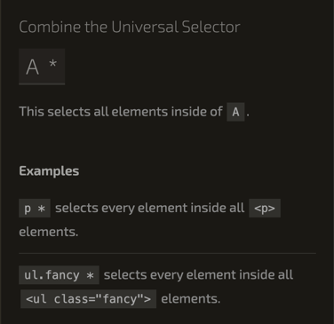

# 박스모델

HTML 각각의 태그들은 모두 '박스모델'의 형태로 이루어져 있다. 


- margin: border를 기준으로 박스의 '**바깥 여백**'이다.
- border: '**박스의 기준이 되는 바깥 테두리 선**'이다. 선의 두께를 설정할 수 있다.
- padding: 박스의 '**안쪽 여백**' 이다.
- contents: 박스의 담길 '**내용 부분**'이다.

## Box 모델 화면 표시 방법

- border-box: border가 고정되고 contents 크기가 변한다.(박스의 사이즈는 고정됨)
- content-box: contents가 고정되고 border의 크기가 변한다.(박스의 사이즈가 달라짐)

```css
* {
    box-sizing: border-box;
    /* 즉, 기본이 content-box, 사이즈가 고정됨 content의 사이즈가 고정됨 */
}
```
<br>

## 선택자


전체 구조는 **rule set**라 불린다. 

선택자(Selector)

- rule set의 맨 앞에 있는 HTML 요소 이름, 이것을 꾸밀 요소를 선택한다. 다른 요소를 꾸미기 위해서 선택한다.
- 선언 `color: red`등 꾸미기 원하는 요소의 속성을 명시한다.

<br>

간단한 에시를 들어보자
```css
p {
    color: red;
    width: 500px;
    border: 1px solid black;
}
```

여기서 알 수 있는 것은 rule set(셀렉터를 구분) 반드시 **{ ... }** 로 감싸저야 한다. 
또한 각각의 선언안에 속성에 해당 값을 구분하는 것은 세미콜론으로 구분한다.


### 여러 요소 선택하기

여러 선택자는 콤마로 구분할 수 있다. 예를 들어 확인해보자.

```css
p, li, h1 {
    color: red;
}
```

이는 p 태그, li 태그, h1 태그를 red로 처리한 것이다.

```html
<!DOCTYPE html>
<html lang="ko">
  <head>
    <title>Document</title>
    <style>
      p,
      li,
      h1 {
        color: red;
      }
    </style>
  </head>
  <body>
    <h1>H1 테스트</h1>
    <ol>
      ol 에 담긴 value는?
      <li>1번 li</li>
      <li>2번 li</li>
      <li>3번 li</li>
    </ol>
    <p>
      p 태그를 태스트헤보자
      <div>abcdef</div>
    </p>
  </body>
</html>
```


### 박스의 기본 값은 content-box이다!

box안에 내용을 담고 이를 html로 브라우저에 제공을 하면 브라우저가 이를 그린다.
이 때 box의 단위는 **content-box**이다. 따라서 box안에 padding을 주면 padding에 따라 사이즈가 커진다.
이 때 사이즈를 고정하려면 전체 선택자를 통해 `* { box-sizing:border-box; }`를 주면 컨텐트의 내용이 중심이 아닌, 
border 사이즈가 고정이되어 내용이 줄어들어 box의 크기가 변하지 않는다.

예를 들어 알아보자 css를 수정하면서 하면 이해가 되는데 도움이 된다.

```html
<!DOCTYPE html>
<html lang="ko">
  <head>
    <title>Document</title>
    <style>
      * {
        box-sizing: border-box;
        /* 즉, 기본이 content-box, 사이즈가 고정됨 content의 사이즈가 고정됨 */
      }
      div {
        width: 80px;
        height: 80px;
        border: 1px solid red;
        padding: 10px; 
        /* padding에 변화를 줄 때 content-box는 기본적으로 내용이 고정되기에 box 사이즈가 커진다.*/
        /* 반면에 border-box는 border가 고정되기에 padding 영역이 증가해서 내용이 줄어듬 */ 
        /* 즉 box사이즈를 결정하는 border이므로 박스의 크기가 커지지 않는다.*/
      }
      
      #contentBox {
        box-sizing: content-box;
      }
      
      #borderBox {
        box-sizing: border-box;
      }
    </style>
  </head>
  <body>
    <div class="contentBox"> contentBox</div>
    <div> 기본 박스</div>
    <div class="borderBox"> borderBox</div>
  </body>
</html>

```





 
