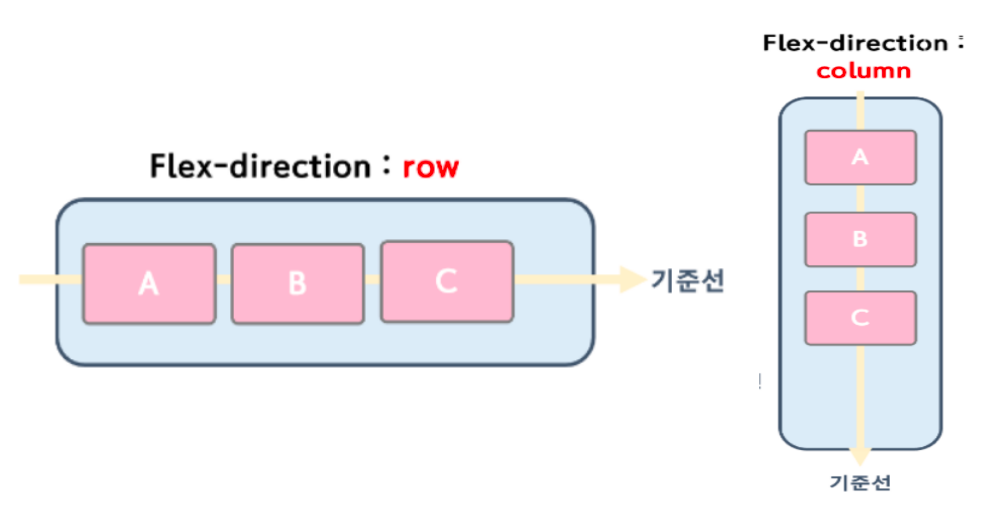
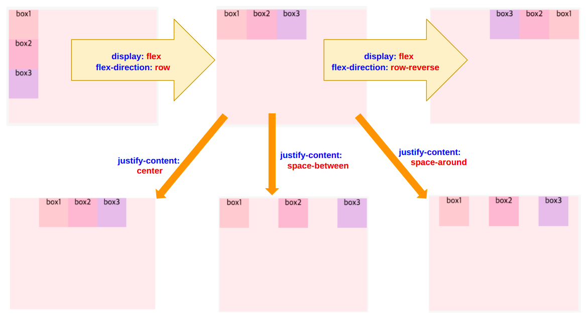
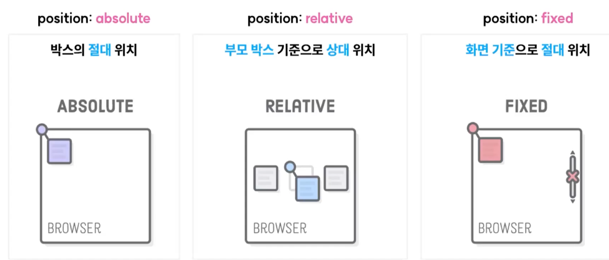

# HTML 태그 정렬

CSS에서 가장 중요한 부분중의 하나는 원하는 위치로 이동하고 **정렬**이다.
어떤 요소를 원하는 위치에 두고 사용자가 접근하기 편한 곳에 두는 것이기 때문이다.

정렬의 방법으로는 가장 많이 사용되는 방법은 **flex**, **position**, **grid**가 있다.

1. flex
2. position
3. grid

# Flex

flex의 핵심은 **여러태그를 하나로 묶어 정렬**하는데에 있습니다.  
정렬하는데 중요한 점은 정렬시 기준이 필요하다는 점이다.(컴퓨터는 사람이 아니기에), **flex는 기준을 부모박스**로 두고 움직이게 된다. 

HTML 각각의 태그들은 모두 '박스모델'의 형태로 이루어져 있다. 



flex는 실제 내용이 있는 **빨간색의 자식박스**들이 있고, **내용들을 정렬하기 위해 감싸고 있는 파란색의 부모박스**로 이루어진다.  
즉, flex의 정렬은 **파란색의 부모박스안에 빨간색의 자식박스를 가로 또는 세로로 나열하고, 부모박스로 자식박스를 정렬한다.**




**flex-direction: row**는 기본 값이다. 이 때 부모의 큰 박스는 행을 기준으로 퍼져있을 것이다. 
이를 화면의 중앙 정렬을 하려면 먼저 부모 박스 기준으로 `justify-content: center; align-items: center`를 통해 할 수 있다.
말 그대로 content를 명시하고, 부모 태그 안에 있는 아이템을 부모 태그안에 어디에 맞출 것이냐를 의미한다.

## 자주 사용되는 flex 속성들

```text
/* 부모박스 */
display: flex;

/* 행기준: row, 열기준: column */
flex-direction: row;
flex-direction: column;

/* flex-direction 기준 수평 방향으로 자식박스 정렬 */
justify-content: center;

/* flex-direction 기준  수직 방향으로 자식박스 정렬 */
align-items: center;
```

## CSS 사이트

1. flex 공식 사이트: https://css-tricks.com/snippets/css/a-guide-to-flexbox/
2. UI 감각 참고 사이트: https://cantunsee.space/
3. Flex 정리 블로그: https://studiomeal.com/archives/197


# Position

포지션은 박스를 개별적으로 어디에 위치 시킬 것인지에 대해 지정해주는 것이다. 아래의 그림과 함께 static(기본 값)이 있다.  
static은 각종 위치 속성이 비활성화되어있다.



이에 따라 flex에 종속되지 않고, 박스를 개별적으로 위치시킬 수 있다.

```css
/* 박스의 절대 위치 */
div {
    position: absolute;
    top: 0px;
    left: 0px;
}

/* 부모 박스 기준으로 상대위치 */
div {
    position: relative;
    top: 0px;
    left: 0px;
}

/* 화면을 기준으로한 절대 위치 */
div {
    position: fixed;
    bottom: 0px;
}
```

> position: fixed 언제 사용하나요?
>
> 화면을 기준으로 고정시키고 싶은 박스가 있는 경우에 사용한다.  
> 모바일 화면의 네비게이션바와 같이 활용된다. 
> 
> 이 때 만약 'absolute'를 사용하면 스크롤할 때 같이 올라가 버릴 것이다. (페이지 기준이므로)


## flex를 활용한 회원 가입 페이지

### html
```html

```
