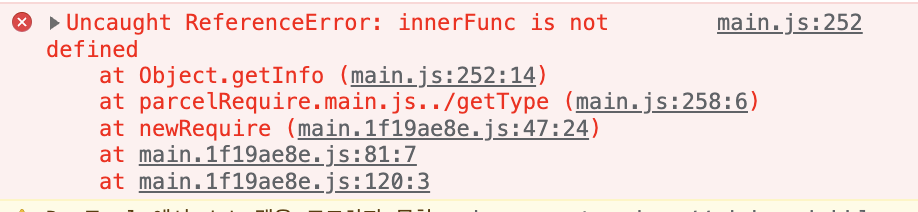

# this

this는 생성자 혹은 메소드에서 객체를 가리킬때 쓰입니다.

this는 때에 따라 다른 값을 가리킵니다. 어디에서 선언되냐에 따라서 그 값이 바뀝니다.

- global scope 에서 사용될 때 this 는 전역 객체를 가리킵니다.(window 객체)
- 함수에서 사용될 때에도 this 는 전역 객체를 가리킵니다.
- 객체에 속한 메소드에서 사용될 때 this 는 메소드가 속한 객체를 가리킵니다.
- 객체에 속한 메소드의 내부함수에서 사용될 때 this 는 전역 객체를 가리킵니다.
- 생성자에서 사용될 때 this 는 이 생성자로 인해 생성된 새로운 객체를 가리킵니다.

## 객체에 속한 메서드의 내부함수

```javascript
const user = {
  name: "jongminChung",
  nickname: "haaeee",
  getInfo: function () {
    innerFunc = function () {
      return `${this.name}님의 닉네임은 ${this.nickname}입니다.`;
    };
    console.log(innerFunc());
  },
};
user.getInfo(); //undefined님의 닉네임은 undefined입니다.
```



`user.getInfo();`는 전역 스코프에서 실행이 됐다. 따라서 여기에서는 `getInfo`의 내부 메서드인 `innerFunc`의 this는 window를 가리킨다. 따라서 에러가 발생하는 것이다.

```javascript
function User(name) {
  this.name = name;
}

User.prototype.normal = function () {
  conosole.log(this.name);
};
User.prototype.arrow = () => {
  conosole.log(this.name);
};

const userA = new User("Haaeee");
userA.normal(); // 정상출력
userA.arrow(); // 에러 발생
```

즉 this는 일반 함수는 호출 위치에 따라 this를 정의하고, 화살표 함수는 자신이 선언된 함수 범위에서(`현재는 전역 범위`)에서 this를 정의하는 것이여서 에러가 발생한 것이다.

```javascript
User.prototype.arrow = () => {
  ...
}
```

현재 전역 범위에서 선언을 하였기에 this는 객체가 아닌 윈도우이다.
