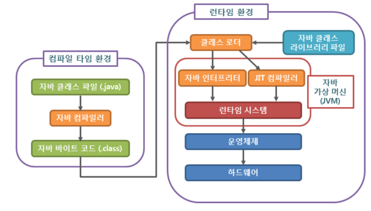

# redis(REmote DIctionary Sever)

- Redis란 오픈소스이며, In-Memory 데이터베이스로써 다양한 자료구조를 제공한다.

- 메모리 접근이 디스크 접근보다 빠르기 때문에 데이터베이스보다 빠르다.

- 자주 사용하지만, 변화가 적은 데이터를 캐시화하여 사용한다.

- Redis 캐싱을 이용하여 성능을 개선하고자 할때, 캐싱 데이터는 update가 자주 일어나지 않는 데이터가 효과적이다.

- 너무 많은 update가 일어나는 데이터일 경우, DB와의 Sync 비용이 발생한다.

- Redis 사용시 반드시 failover에 대한 고려가 필요하다. <br/>
  ex) 레디스 장애시 데이터 베이스에서 조회, 레디스 이중화 및 백업

---

> https://redis.io/docs/data-types/tutorial/

<br>

# docker 에서 접근

```bash
$ docker exec -it [container id/ container name] redis-cli --raw
```

- Java는 객체지향 프로그래밍 언어입니다.
- 기본 자료형을 제외한 모든 요소들이 객체로 표현되고, 객체 지향 개념의 특징인 캡슐화, 상속, 다형성이 잘 적용된 언어입니다.

- 장점

  - JVM(자바가상머신) 위에서 동작하기 때문에 운영체제에 독립적이다.
  - GabageCollector를 통한 자동적인 메모리 관리가 가능하다.

- 단점

  - JVM 위에서 동작하기 때문에 실행 속도가 상대적으로 느리다.
  - 다중 상속이나 타입에 엄격하며, 제약이 많다.

# JVM의 역할에 대해 설명해주세요.

JVM은 스택 기반으로 동작하며, Java Byte Code를 OS에 맞게 해석 해주는 역할을 하고 가비지컬렉션을 통해 자동적인 메모리 관리를 해줍니다.

# Java의 컴파일 과정에 대해 설명해주세요.

1. 개발자가 .java 파일을 생성한다.
2. build를 한다.
3. java compiler의 javac의 명령어를 통해 바이트코드(.class)를 생성한다.
4. Class Loader를 통해 JVM 메모리 내로 로드한다.
5. 실행엔진을 통해 컴퓨터가 읽을 수 있는 기계어로 해석된다.(각 운영체제에 맞는 기계어)



# 오버라이딩(Overriding)과 오버로딩(Overloading)에 대해 설명해주세요.

- 오버라이딩(Overriding)은 상위 클래스에 있는 메소드를 하위 클래스에서 재정의 하는 것을 말합니다.
- 오버로딩(Overloading)은 매개변수의 개수나 타입을 다르게 하여 같은 이름의 메소드를 여러 개 정의하는 것을 말합니다.
