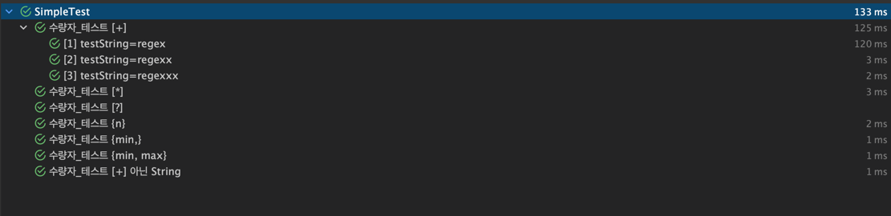

정규표현식(Regular Expressions)을 줄여서 Regex라고 한다.    
Regex는 문자열에 어떤 패턴의 문자들이 있는지 찾는데 도움을 준다.

이 글은 Regex 패턴과 사용 방법 위주로 정리한다.

## Metacharacters

---

**Metacharacters**는 Regex의 패턴에서 어떤 문자가 특별한 의미를 갖는 것을 말한다. 

예를 들어 `\d`는 0에서 9사이의 숫자를 의미한다.

자주 사용되는 **Metacharacters** 다음과 같다.

### 수량자

특정 문자를 문자열에서 찾고 싶을 때 그냥 그대로 패턴에 적용하면 된다. 

`regex`라고 적으면 문자열에서 regex이 들어간 단어를 찾아준다.

반면에, `"regex"`와 `"regexxxxxxxxx"`도 찾고 싶을 때는 어떻게 처리해야할까요.

리스트로 패턴을 저장해놓고 매번 수정을 해야하는 것일까요?

이는 **특정 문자 하나에 수량자를 적용하여 문자의 개수를 유연하게 지정할 수 있다.**

예를 들어 `regex+`는 x가 1개 이상 포함되어야 한다는 뜻이다.

`regex*`는 x가 0개 혹은 1개를 뜻한다.

수량자는 사용자 정의 하에 해당 문자의 개수 범위도 정할 수 있다.

`regggggggggex`의 g가 7개 이상 11개 이하인 것만 찾고 싶다면 `reg{7,11}ex` 패턴을 사용하면 된다.


<br>

#### Test 코드

```java
class SimpleTest {

    @DisplayName("수량자_테스트 [+]")
    @ParameterizedTest
    @MethodSource("stringProvider")
    void 수량자_테스트_1(String testString) {
        String pattern = "regex+";
        assertThat(testString.matches(pattern)).isTrue();
    }

    static Stream<String> stringProvider() {
        return Stream.of("regex", "regexx", "regexxx");
    }

    @Test
    @DisplayName("수량자_테스트 [+] 아닌 String")
    void 수량자_테스트_1_false() {
        String pattern = "regex+";
        List<String> strings = List.of("rege", "regeex");
        assertThat(strings.get(0).matches(pattern)).isFalse();
        assertThat(strings.get(1).matches(pattern)).isFalse();
    }

    @Test
    @DisplayName("수량자_테스트 [*]")
    void 수량자_테스트_2() {
        String pattern = "regex*";
        List<String> strings = List.of("rege", "regex", "regexxxxx");
        assertThat(strings.get(0).matches(pattern)).isTrue();
        assertThat(strings.get(1).matches(pattern)).isTrue();
        assertThat(strings.get(2).matches(pattern)).isTrue();
    }

    @Test
    @DisplayName("수량자_테스트 [?]")
    void 수량자_테스트_3() {
        String pattern = "regex?";
        List<String> strings = List.of("rege", "regex", "regexxxxx");
        assertThat(strings.get(0).matches(pattern)).isTrue();
        assertThat(strings.get(1).matches(pattern)).isTrue();
        assertThat(strings.get(2).matches(pattern)).isFalse();
    }

    @Test
    @DisplayName("수량자_테스트 {n}")
    void 수량자_테스트_4() {
        String pattern = "regex{5}";
        List<String> strings = List.of("rege", "regex", "regexxxxx");
        assertThat(strings.get(0).matches(pattern)).isFalse();
        assertThat(strings.get(1).matches(pattern)).isFalse();
        assertThat(strings.get(2).matches(pattern)).isTrue();
    }

    @Test
    @DisplayName("수량자_테스트 {min,}")
    void 수량자_테스트_5() {
        String pattern = "regex{1,}";
        List<String> strings = List.of("rege", "regex", "regexxxxx");
        assertThat(strings.get(0).matches(pattern)).isFalse();
        assertThat(strings.get(1).matches(pattern)).isTrue();
        assertThat(strings.get(2).matches(pattern)).isTrue();
    }

    @Test
    @DisplayName("수량자_테스트 {min, max}")
    void 수량자_테스트_6() {
        String pattern = "regex{1,4}";
        List<String> strings = List.of("rege", "regex", "regexxx", "regexxxx", "regexxxxx");
        assertThat(strings.get(0).matches(pattern)).isFalse();
        assertThat(strings.get(1).matches(pattern)).isTrue();
        assertThat(strings.get(2).matches(pattern)).isTrue();
        assertThat(strings.get(3).matches(pattern)).isTrue();
        assertThat(strings.get(4).matches(pattern)).isFalse();
    }
}
```

#### 테스트 결과



<br><br>

## [ ], -, ^

### [ ]

---

`[ ]`는 한 글자를 표현한다. 대괄호 안에는 가능한 문자를 작성하면 된다.

예를 들어 주어진 문자열에서 top, tap, txp 을 찾고 싶다고 가정하면 `t[oax]p` 사용하면 된다.

<br>

### -

`-`는 범위를 나타낼 수 있다. 흔히, 0-9, a-z, A-Z를 표기하곤 한다.

예를 들어 아무 소문자 + op 를 찾고 싶다면 `[a-z]ap` 패턴을 통해 찾을 수 있을 겁니다. 

이럴 경우 aop, bop, …, zop 모두 찾을 수 있을 겁니다.

<br>

### ^

^(caret)에 대해 설명하기 전에 하나만 당부의 말씀을 드리겠습니다.

`^ ?` 이 두 녀석은 다재다능한 녀석입니다. 

반드시 그걸 염두해두시고 쓰임새를 구분하셔야 정규표현식 패턴이 헷갈리지 않는다.

자 다시 ^에 대해 설명하면, [ ] 대괄호 안에 ^를 어미에 두게 되면 이 녀석들은 빼고 한 글자를 의미합니다.

예를 들어 `[^cpt]op` 패턴은 cpt를 제외한 문자와 연속된 op 이 문자를 찾습니다. 

kop, zop 뿐만 아니라 가ap, *ap 모두 찾을 수 있습니다.


| Regular Expressions |    Description    |
|:-------------------:|:-----------------:|
|     .(dot, 온점)      |   어떤 문자 1개를 의미    |
|       ^regex        | regex로 문자열이 시작 의미 |
|      int + int      |        int        |
|     long + long     |       long        |
|    float + float    |       float       |
|   double + double   |      double       |
|     int + float     |       float       |
|    long + float     |       float       |
|   float + double    |      double       |

```java
import java.io.BufferedReader;
import java.io.IOException;
import java.io.InputStreamReader;

public class Main {
    static int n, m;
    static int[][] grid;
    static int[] route;

    public static void main(String[] args) throws IOException {
        BufferedReader br = new BufferedReader(new InputStreamReader(System.in));
        n = Integer.parseInt(br.readLine());
        m = Integer.parseInt(br.readLine());

        grid = new int[n + 1][n + 1];

        for (int i = 0; i < n + 1; i++) {
            for (int j = 0; j < n + 1; j++) {
                System.out.print(grid[i][j]);
            }
            System.out.println();
        }
        int k;
        System.out.println(k);
    }

}
```
