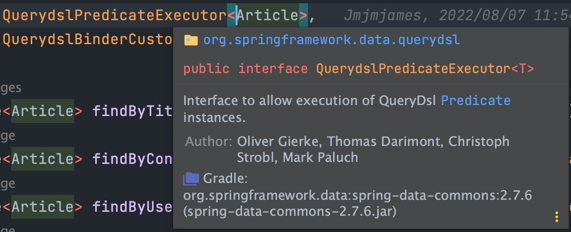
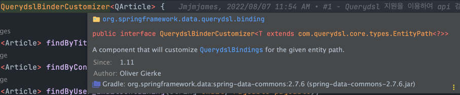

# QueryDSL 추가

> QueryDSL 추가하는 방법은 다음과 같다.

<br>

## Spring boot 2.7 이전 QueryDSL 설정

##### build.gradle

---

```gradle
plugins {
    id 'org.springframework.boot' version '2.6.12'
    id 'io.spring.dependency-management' version '1.0.14.RELEASE'
    id 'java'
}

group = 'com.example'
version = 'v1.1'
sourceCompatibility = '17'

configurations {
    compileOnly {
        extendsFrom annotationProcessor
    }
}

repositories {
    mavenCentral()
}

dependencies {
    // Querydsl
    implementation 'com.querydsl:querydsl-jpa'
    // Querydsl JPAAnnotationProcessor 사용 지정
    annotationProcessor "com.querydsl:querydsl-apt:5.0.0:jpa"
    // java.lang.NoClassDefFoundError(javax.annotation.Entity) 발생 대응
    annotationProcessor "jakarta.persistence:jakarta.persistence-api"
    // java.lang.NoClassDefFoundError(javax.annotation.Generated) 발생 대응
    annotationProcessor "jakarta.annotation:jakarta.annotation-api"
}

// clean task 실행시 QClass 삭제
clean {
    delete file('src/main/generated') // 인텔리제이 Annotation processor 생성물 생성 위치
}
```

<br><br>

## Spring boot 2.7 QueryDSL 설정

---

```gradle
plugins {
    id 'java'
    id 'org.springframework.boot' version '2.7.6'
    id 'io.spring.dependency-management' version '1.0.15.RELEASE'
}

group = 'com.example'
version = 'v1.1'
sourceCompatibility = '17'

configurations {
    compileOnly {
        extendsFrom annotationProcessor
    }
}

repositories {
    mavenCentral()
}

dependencies {
    // queryDSL 설정
    implementation "com.querydsl:querydsl-jpa"
    implementation "com.querydsl:querydsl-core"
    implementation "com.querydsl:querydsl-collections"
    annotationProcessor "com.querydsl:querydsl-apt:${dependencyManagement.importedProperties['querydsl.version']}:jpa"
    // querydsl JPAAnnotationProcessor 사용 지정
    annotationProcessor "jakarta.annotation:jakarta.annotation-api"
    // java.lang.NoClassDefFoundError (javax.annotation.Generated) 대응 코드
    annotationProcessor "jakarta.persistence:jakarta.persistence-api"
    // java.lang.NoClassDefFoundError (javax.annotation.Entity) 대응 코드
}

// Querydsl 설정부
def generated = 'src/main/generated'

// querydsl QClass 파일 생성 위치를 지정
tasks.withType(JavaCompile) {
    options.getGeneratedSourceOutputDirectory().set(file(generated))
}

// java source set 에 querydsl QClass 위치 추가
sourceSets {
    main.java.srcDirs += [generated]
}

// gradle clean 시에 QClass 디렉토리 삭제
clean {
    delete file(generated)
}

jar {
    enabled = false
}
```

- `def generated = 'src/main/generated'`: groovy 문법으로 변수를 생성

    - Q클래스는 build 디렉토리에 들어가기에 이를 가시적으로 generated 부분에 들어 내려한다.

    - gradle 빌드 도구 scan, idea 빌드 도구 scan 영역이 다를 수 있는 경우 또는 중복 문제가 발생하는 경우가 존재한다.

<br>

### .gitignore 에 Querydsl 추가

```
### Querydsl
/src/main/generated
```

<br><br>

## Repository에 QueryDSL Interface

> SELECT 메서드를 제공한다.


```java
public interface ArticleRepository extends
        JpaRepository<Article, Long>,
        ArticleRepositoryCustom,
        QuerydslPredicateExecutor<Article>,
        QuerydslBinderCustomizer<QArticle> {
    ...
    
    @Override
    default void customize(QuerydslBindings bindings, QArticle root) {
        bindings.excludeUnlistedProperties(true);
        bindings.including(root.title, root.content, root.hashtag, root.createdAt, root.createdBy);
        bindings.bind(root.title).first(StringExpression::likeIgnoreCase);  // like '${v}'
        bindings.bind(root.title).first(StringExpression::containsIgnoreCase);  // like '%${v}%'
        bindings.bind(root.content).first(StringExpression::containsIgnoreCase);
        bindings.bind(root.hashtag).first(StringExpression::containsIgnoreCase);
        bindings.bind(root.createdAt).first(DateTimeExpression::eq);
        bindings.bind(root.createdBy).first(StringExpression::containsIgnoreCase);
    }
}
```

- QuerydslPredicateExecutor<Entity>

    - 

    - Entity, 즉 Article 안에 있는 모든 필드에 대해 검색 기능을 추가한다.

    - **즉, 부분 검색이 아닌 정확한 exact Match만 제공한다.**

- QuerydslPredicateExecutor<Q_Entity>

    - 

    - Java 8 이상 인터페이스에서 구현이 가능하다. (**default method**)

    - `bindings.excludeUnlistedProperties(true);`: 선택적으로 검색이 가능하게 할 수 있다.

    - `bindings.including(root.title, root.content, root.hashtag, root.createdAt);`: 원하는 필드를 추가한다.
